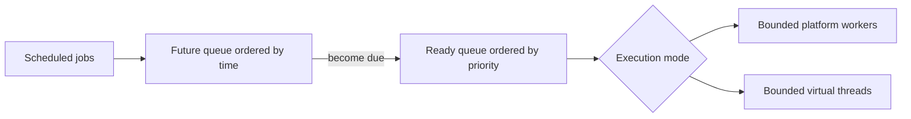
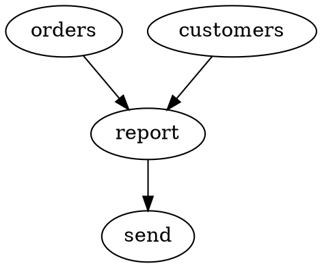

# J-Scheduler

Modern task scheduling for Java.

J-Scheduler is a lightweight embedded execution engine for Java 21 applications. It separates time
eligibility from ready-work priority, offers bounded platform or virtual-thread execution, exposes
thread-safe job handles, and defines cancellation and shutdown behavior explicitly.

> Version 2 is under active development. The core engine, resilient execution pipeline, and
> lightweight workflow DAGs are available; Spring Boot integration is planned for a later phase.

## Features

- Immediate, delayed, fixed-rate, and fixed-delay scheduling
- Priority ordering among ready jobs with deterministic FIFO tie-breaking
- Bounded platform-thread pools
- Virtual-thread-per-task execution with an explicit concurrency limit
- Observable lifecycle states and immutable execution snapshots
- Fixed-delay and exponential-backoff retries with filtering and jitter
- Cooperative execution timeouts
- Explicit recurring concurrency policies
- Per-job and named token-bucket rate limits
- Per-job circuit breakers
- Structured, failure-isolated execution events
- Validated dependency workflows with parallel branches and deterministic DOT export
- Cancellation before, during, and between recurring executions
- Immediate and graceful shutdown
- Failure isolation for tasks and lifecycle listeners
- Injectable `Clock` for deterministic lifecycle timestamps
- Deprecated compatibility facade for the 1.x API

## Requirements

- Java 21 or newer
- The included Gradle wrapper

## Quick start

```java
import io.github.voraes.jscheduler.Job;
import io.github.voraes.jscheduler.ConcurrencyPolicy;
import io.github.voraes.jscheduler.RetryPolicy;
import io.github.voraes.jscheduler.Schedule;
import io.github.voraes.jscheduler.Scheduler;

import java.time.Duration;

try (Scheduler scheduler = Scheduler.builder()
        .virtualThreads()
        .maxConcurrentJobs(100)
        .build()) {

    var handle = scheduler.schedule(
            Job.builder("sync-customers")
                    .task(this::syncCustomers)
                    .priority(10)
                    .timeout(Duration.ofSeconds(30))
                    .retry(RetryPolicy.exponentialBackoff()
                            .maxAttempts(5)
                            .initialDelay(Duration.ofMillis(250))
                            .maxDelay(Duration.ofSeconds(20))
                            .jitter(0.20)
                            .build())
                    .concurrency(ConcurrencyPolicy.SKIP_IF_RUNNING)
                    .build(),
            Schedule.fixedDelay(Duration.ofMinutes(1)));

    System.out.println(handle.id());
    System.out.println(handle.status());
}
```

## Architecture and ordering



Time eligibility always comes first. A high-priority job scheduled for the future cannot displace a
lower-priority job that is already due. Once multiple jobs are ready, larger priority values execute
first. Equal priorities are ordered by due time and then submission order. This ordering is
deterministic at the ready-queue boundary; operating-system thread scheduling can naturally affect
the observed start order when multiple workers are available. Strict priority can starve lower-priority
work under a continuous higher-priority load; the scheduler deliberately provides no implicit priority
aging.

## Scheduling semantics

### One-time work

```java
scheduler.execute(job); // immediate
scheduler.schedule(job, Schedule.delayed(Duration.ofSeconds(5)));
```

### Fixed rate

```java
scheduler.schedule(job,
        Schedule.fixedRate(Duration.ofSeconds(1), Duration.ofSeconds(10)));
```

Fixed rate follows the planned cadence. If an execution lasts longer than its period, later
occurrences become ready and may overlap when execution capacity is available. Missed cadence points
are not silently discarded.

### Fixed delay

```java
scheduler.schedule(job,
        Schedule.fixedDelay(Duration.ofSeconds(1), Duration.ofSeconds(10)));
```

Fixed delay starts its delay only after the preceding execution completes. Occurrences of that job do
not overlap.

## Execution lifecycle

Each occurrence follows a validated state machine:

```text
SCHEDULED -> READY -> RUNNING -> SUCCEEDED | FAILED | TIMED_OUT
     |          |
     +----------+-----------> CANCELLED
                +-----------> SKIPPED
```

`JobHandle` safely exposes the aggregate job status, next planned execution, and latest immutable
`JobExecution` snapshot. Recurring handles report `RUNNING` while any occurrence is active, `READY`
when work is queued, and `SCHEDULED` when waiting for the next occurrence.

Task exceptions are captured in `JobResult`; they never terminate scheduler coordination or worker
infrastructure. Lifecycle listeners are similarly isolated. The core library does not print to
standard output.

## Retries

```java
RetryPolicy retry = RetryPolicy.exponentialBackoff()
        .maxAttempts(5) // includes the initial execution
        .initialDelay(Duration.ofMillis(250))
        .maxDelay(Duration.ofSeconds(30))
        .jitter(0.20)
        .retryOn(IOException.class)
        .build();
```

Fixed-delay and exponential backoff are available. Jitter is proportional and bounded by
`maxDelay`. A failed attempt is returned to the scheduler's timed queue, so backoff never occupies a
worker or a global concurrency permit. Retry predicates run only after a task failure. Cancellation,
shutdown, interruption, and timeout are not retried by default; timeout can be selected explicitly
with `retryOn(JobTimeoutException.class)`.

Retries belong to the same logical occurrence: `JobExecution.sequence()` stays constant while
`attempt()` increases. A fixed-delay recurrence is scheduled only after all retries finish. Fixed-rate
cadence remains independent, so distinct occurrences may coexist.

## Timeouts

```java
Job.builder("remote-call")
        .task(this::callRemoteSystem)
        .timeout(Duration.ofSeconds(10))
        .build();
```

At the deadline J-Scheduler records `TIMED_OUT`, emits `JobTimedOut`, and requests interruption. Java
cannot safely terminate arbitrary code. A task that ignores interruption continues occupying its
execution permit until it returns; this prevents configured concurrency bounds from being silently
violated.

## Concurrency policies

Recurring jobs can choose one policy:

- `ALLOW`: occurrences may overlap.
- `SKIP_IF_RUNNING`: a due occurrence is skipped if another occurrence is running.
- `QUEUE`: due occurrences wait and execute serially.
- `REPLACE`: running occurrences receive an interruption/cancellation request before the new
  occurrence begins. Non-cooperative code may briefly overlap with its replacement.

These policies apply per `JobHandle`, including retry attempts. They do not bypass the scheduler-wide
platform/virtual-thread concurrency limit.

## Rate limiting

```java
.rateLimit(RateLimit.perSecond(10))
.rateLimit("payments-api", RateLimit.perSecond(10))
```

Rate limiting uses a monotonic token bucket. The first form creates a bucket for one scheduled job;
the named form shares a bucket across jobs. All jobs using the same group must provide identical
configuration. When no token is available, work is deferred through the timed queue instead of
blocking a worker.

## Circuit breaking

```java
.circuitBreaker(CircuitBreakerPolicy.builder()
        .failureThreshold(5)
        .openDuration(Duration.ofSeconds(30))
        .halfOpenAttempts(1)
        .build())
```

Each scheduled job owns a `CLOSED -> OPEN -> HALF_OPEN -> CLOSED` state machine. Consecutive failures
open the circuit. Occurrences are skipped while it is open; after `openDuration`, a bounded number of
half-open probes are admitted. A failed probe reopens the circuit and successful probes close it.
The current state is available through `handle.circuitState()`.

## Execution events

```java
Scheduler scheduler = Scheduler.builder()
        .eventListener(event -> metrics.record(event))
        .eventListener(event -> audit(event))
        .build();
```

Structured events cover scheduling, start, success, failure, retry, skip, timeout, cancellation,
rate-limit deferral, and circuit open/close transitions. An ordered daemon dispatcher isolates
listener latency and reentrant scheduler calls from the engine; one listener exception does not
prevent delivery to the others.

## Workflows

```java
Workflow workflow = Workflow.builder("daily-report")
        .job("orders", this::fetchOrders)
        .job("customers", this::fetchCustomers)
        .job("report", this::buildReport)
        .job("send", this::sendReport)
        .dependsOn("report", "orders", "customers")
        .dependsOn("send", "report")
        .failurePolicy(WorkflowFailurePolicy.SKIP_DEPENDENTS)
        .build();

WorkflowHandle handle = scheduler.schedule(workflow);
WorkflowResult result = handle.completion()
        .toCompletableFuture()
        .join();
```

Workflows are immutable directed acyclic graphs. Unknown dependencies and cycles are rejected before
execution; cycle errors include the concrete path. Nodes become runnable only after all dependencies
succeed, while independent ready nodes use the scheduler's normal concurrency and priority rules.

Each node is submitted through the ordinary job engine. Its retry, timeout, rate limit, circuit
breaker, priority, events, and global platform/virtual-thread bound therefore behave exactly as they
do outside a workflow.

Failure policies are deliberately small:

- `FAIL_WORKFLOW` interrupts active nodes and skips all pending nodes after the first failure.
- `SKIP_DEPENDENTS` skips transitive dependents of a failure while independent branches finish.

`WorkflowResult` contains immutable per-node status and final `JobExecution` snapshots. Cancelling a
workflow cancels active node handles and prevents pending nodes from starting. Interruption remains
cooperative.

For documentation and debugging, `workflow.toDot()` produces deterministic Graphviz DOT:



## Cancellation

```java
handle.cancel();      // remove future/ready occurrences; let running work finish
handle.cancel(true);  // also request interruption of running work
```

Cancellation prevents every future recurrence. Interruption is cooperative: Java cannot safely force
arbitrary user code to terminate, so running tasks must respond to interruption themselves.

## Shutdown

`shutdown()` rejects new work, cancels future and ready work, requests interruption of running work,
and stops scheduler infrastructure.

`shutdownGracefully(timeout)` rejects new work and cancels work that is not yet due, including future
recurrences. Work that is already ready or running is allowed to finish until the timeout. If the
timeout expires, remaining ready work is cancelled and running work is interrupted. It returns
`true` only when work completed within the timeout.

`close()` performs a graceful shutdown with a 30-second timeout. A JVM shutdown hook is available only
through the explicit `registerShutdownHook()` opt-in.

## Building

```bash
./gradlew test
./gradlew check
```

`check` compiles with Java 21 and strict compiler linting, runs the test suite and coverage report,
and validates public Javadocs. CI exercises Java 21 and Java 25.

## Migrating from 1.x

The default-package `BackgroundTaskScheduler` remains as a deprecated facade for source compatibility.
New code should use `io.github.voraes.jscheduler.Scheduler`, `Job`, `Schedule`, and `JobHandle`.

Important changes:

- Scheduling now returns a handle in the v2 API.
- Delays and intervals use `Duration` rather than primitive/`TimeUnit` pairs.
- Priority applies only after a job becomes due. The 1.x implementation could execute future work
  early by polling a global priority queue from an unrelated timer callback.
- Recurring jobs now actually recur; 1.x removed their only queue entry on the first callback.
- Failures are available through execution results instead of being printed.
- `shutdown()` is immediate. Use `shutdownGracefully(Duration)` when ready work should drain.
- Virtual-thread concurrency is bounded rather than implicitly unlimited.

## Project scope

J-Scheduler is an in-process scheduler, not a distributed orchestration platform. It does not provide
leader election, durable lambda persistence, cluster coordination, or database-backed scheduling.

## License

Licensed under the [MIT License](LICENSE).
