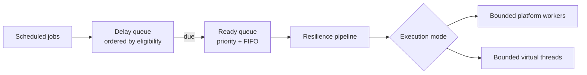
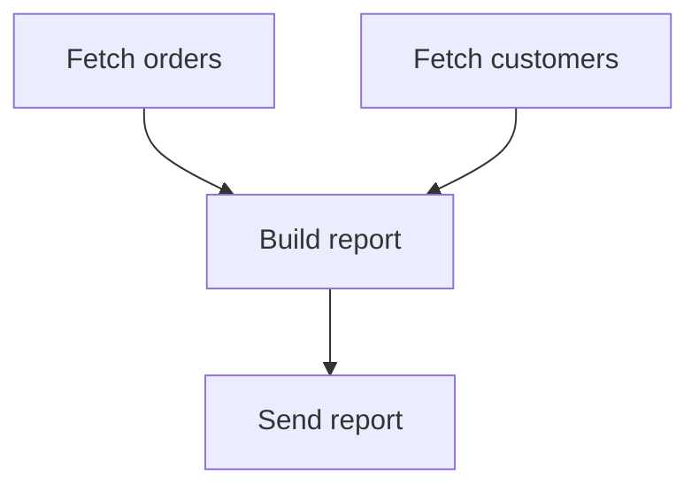

# J-Scheduler

Modern resilient task scheduling for Java.

J-Scheduler is a lightweight embedded scheduling and execution engine for Java 21 applications.
Schedule work, bound concurrency, retry failures, use virtual threads, and compose dependency
workflows without operating a separate scheduling platform.

[](https://github.com/Voraes/j-scheduler/actions/workflows/gradle.yml)


> J-Scheduler 2 is under active development. Publishing metadata is prepared, but no Maven Central
> release is claimed yet.

## Features

- Immediate, delayed, fixed-rate, and fixed-delay scheduling
- Priority ordering among ready work with deterministic FIFO tie-breaking
- Bounded platform-thread pools and bounded virtual-thread execution
- Thread-safe handles, immutable execution snapshots, and explicit lifecycle states
- Fixed and exponential retry with filtering, jitter, and non-blocking backoff
- Cooperative timeouts and cancellation
- Per-job recurring concurrency policies
- Token-bucket rate limits and circuit breakers
- Structured, failure-isolated lifecycle events
- Validated workflow DAGs with parallel branches and failure policies
- Spring Boot auto-configuration, declarative scheduling, Micrometer, and Actuator health
- JMH benchmarks and dedicated concurrency stress tests

## Quick start

```java
import io.github.voraes.jscheduler.ConcurrencyPolicy;
import io.github.voraes.jscheduler.Job;
import io.github.voraes.jscheduler.JobHandle;
import io.github.voraes.jscheduler.RetryPolicy;
import io.github.voraes.jscheduler.Schedule;
import io.github.voraes.jscheduler.Scheduler;

import java.time.Duration;

try (Scheduler scheduler = Scheduler.builder()
        .virtualThreads()
        .maxConcurrentJobs(100)
        .build()) {

    JobHandle handle = scheduler.schedule(
            Job.builder("sync-customers")
                    .task(this::syncCustomers)
                    .priority(10)
                    .timeout(Duration.ofSeconds(30))
                    .retry(RetryPolicy.exponentialBackoff()
                            .maxAttempts(5)
                            .initialDelay(Duration.ofMillis(250))
                            .maxDelay(Duration.ofSeconds(20))
                            .jitter(0.20)
                            .build())
                    .concurrency(ConcurrencyPolicy.SKIP_IF_RUNNING)
                    .build(),
            Schedule.fixedDelay(Duration.ofMinutes(1)));

    System.out.println(handle.id());
}
```

## Why J-Scheduler?

`ScheduledExecutorService` is useful infrastructure, but applications often need consistent behavior
around priority, retries, overlap, rate limits, cancellation, and dependency graphs. J-Scheduler puts
those policies behind one small typed API while remaining an in-process library.

It is deliberately not a distributed scheduler. It does not provide leader election, durable lambda
persistence, cluster coordination, or database-backed execution. Use a distributed platform when
work must survive process loss or coordinate across nodes.

## Scheduling



Time eligibility always comes first. Priority orders only jobs that are already due; a future
high-priority job never displaces ready lower-priority work. Equal priorities are ordered by due time
and submission order at the ready-queue boundary.

```java
scheduler.execute(job);
scheduler.schedule(job, Schedule.delayed(Duration.ofSeconds(5)));
scheduler.schedule(job, Schedule.fixedRate(Duration.ofSeconds(10)));
scheduler.schedule(job, Schedule.fixedDelay(Duration.ofSeconds(10)));
```

Fixed rate follows planned cadence, so occurrences can overlap when execution capacity allows. Fixed
delay starts only after the previous occurrence, including its retries, has completed.

## Virtual threads

```java
Scheduler scheduler = Scheduler.builder()
        .virtualThreads()
        .maxConcurrentJobs(200)
        .build();
```

Virtual threads reduce the cost of blocking threads; they do not make databases or remote services
unbounded. J-Scheduler therefore requires an explicit concurrency limit and retains the permit while
non-cooperative timed-out code is still running.

Use `platformThreads(int)` for a bounded reusable worker pool. Both execution modes share the same
scheduling, resilience, lifecycle, and workflow semantics.

## Retries

```java
RetryPolicy retry = RetryPolicy.exponentialBackoff()
        .maxAttempts(5) // includes the initial attempt
        .initialDelay(Duration.ofMillis(250))
        .maxDelay(Duration.ofSeconds(30))
        .jitter(0.20)
        .retryOn(IOException.class)
        .build();
```

Backoff returns work to the timed queue instead of occupying a worker or concurrency permit. Retries
belong to the same logical occurrence: its sequence remains stable while its attempt increases.
Cancellation, shutdown, interruption, and timeout are not retried by default.

## Timeouts

```java
Job.builder("remote-call")
        .task(this::callRemoteSystem)
        .timeout(Duration.ofSeconds(10))
        .build();
```

At the deadline J-Scheduler records `TIMED_OUT`, emits a timeout event, and requests interruption.
Java cannot safely terminate arbitrary user code. A task that ignores interruption can continue until
it returns, and it keeps its execution permit while doing so.

## Concurrency policies

Recurring jobs choose how overlapping occurrences behave:

| Policy | Behavior |
| --- | --- |
| `ALLOW` | Allow overlap when global execution capacity exists. |
| `SKIP_IF_RUNNING` | Mark a due occurrence skipped while another is running. |
| `QUEUE` | Keep due occurrences and execute them one at a time. |
| `REPLACE` | Request interruption of running occurrences before the new one starts. |

`REPLACE` remains cooperative; code that ignores interruption may briefly overlap its replacement.

## Workflows

```java
Workflow workflow = Workflow.builder("daily-report")
        .job("orders", this::fetchOrders)
        .job("customers", this::fetchCustomers)
        .job("report", this::buildReport)
        .job("send", this::sendReport)
        .dependsOn("report", "orders", "customers")
        .dependsOn("send", "report")
        .failurePolicy(WorkflowFailurePolicy.SKIP_DEPENDENTS)
        .build();

WorkflowResult result = scheduler.schedule(workflow)
        .completion().toCompletableFuture().join();
```



Graphs are immutable and validated for unknown nodes and cycles before execution. Independent nodes
run in parallel. Every node uses the ordinary job engine, so retry, timeout, priority, rate limits,
circuit breaking, events, and global concurrency bounds continue to apply.

`FAIL_WORKFLOW` stops independent work after the first failure. `SKIP_DEPENDENTS` skips transitive
dependents while allowing unrelated branches to finish.

## Spring Boot

The separate starter keeps Spring dependencies out of the core:

```kotlin
implementation("io.github.voraes:j-scheduler-spring-boot-starter:2.0.0-SNAPSHOT")
implementation("org.springframework.boot:spring-boot-starter-actuator") // optional
```

```yaml
j-scheduler:
  execution:
    mode: virtual
    max-concurrent-jobs: 200
  shutdown:
    timeout: 30s
```

The starter provides a `Scheduler` bean, backs off for an application-defined scheduler, and performs
bounded graceful shutdown. Simple recurring methods can use declarative scheduling:

```java
@ScheduledJob(name = "invoice-sync", initialDelay = "5s", fixedDelay = "30s", priority = 10)
public void syncInvoices() {
    // application work
}
```

Methods must be non-static, take no arguments, and return `void`; invalid signatures fail startup.
Resilience remains in the programmatic `Job` API instead of turning the annotation into a second
configuration language.

See the runnable [`spring-boot-example`](examples/spring-boot-example).

## Observability

Core applications can attach ordered, failure-isolated `JobEventListener` instances. Events cover
scheduling, start, completion, retry, skip, timeout, cancellation, rate-limit deferral, and circuit
transitions, providing a vendor-neutral tracing hook.

With Micrometer, the starter publishes:

- `j.scheduler.jobs.scheduled`, `running`, `completed`, `failed`, `retried`, and `skipped`
- `j.scheduler.job.duration`
- `j.scheduler.queue.size`

Meters contain no arbitrary job-name or job-ID tags. Actuator health reports aggregate scheduler
status, execution mode, concurrency, and queue counts without exposing task payloads.

Named rate-limit groups retain token history for the scheduler lifetime so sequential submissions
share one continuous limit. Treat group names as bounded configuration keys, not request identifiers.

## Benchmarks

The standalone JMH suite covers submission and priority contention, 100/10,000-task batches,
platform and virtual threads, simulated blocking I/O, retries, and workflow scheduling. No short smoke
number or machine-specific result is presented as a project performance claim.

```bash
./gradlew :benchmarks:jmh
```

See [`docs/BENCHMARKS.md`](docs/BENCHMARKS.md) for workloads, warmup, measurements, forks, profiling,
hardware reporting, and interpretation rules.

## Installation

Requirements:

- JDK 21 or newer
- The checked-in Gradle wrapper for source builds

The intended Maven coordinates are:

```text
io.github.voraes:j-scheduler:2.0.0
io.github.voraes:j-scheduler-spring-boot-starter:2.0.0
```

No Maven Central release is claimed yet. To consume the current snapshot locally:

```bash
./gradlew publishToMavenLocal
```

```kotlin
implementation("io.github.voraes:j-scheduler:2.0.0-SNAPSHOT")
```

Sources, Javadocs, required POM metadata, conditional PGP signing, and a local staging repository are
configured. External publication requires explicit maintainer authorization; see
[`docs/RELEASING.md`](docs/RELEASING.md).

## Documentation

- [Benchmark methodology](docs/BENCHMARKS.md)
- [Concurrency model and review invariants](docs/CONCURRENCY.md)
- [Migration from 1.x](docs/MIGRATION_V2.md)
- [Release preparation](docs/RELEASING.md)
- [Changelog](CHANGELOG.md)
- Generated API documentation: `./gradlew javadoc`

## Contributing

Run the ordinary quality gate with:

```bash
./gradlew clean check
```

Concurrency changes should also pass the opt-in bounded stress suite:

```bash
./gradlew stressTest
```

See [`CONTRIBUTING.md`](CONTRIBUTING.md) and report vulnerabilities through
[`SECURITY.md`](SECURITY.md).

## License

J-Scheduler is available under the [MIT License](LICENSE).
